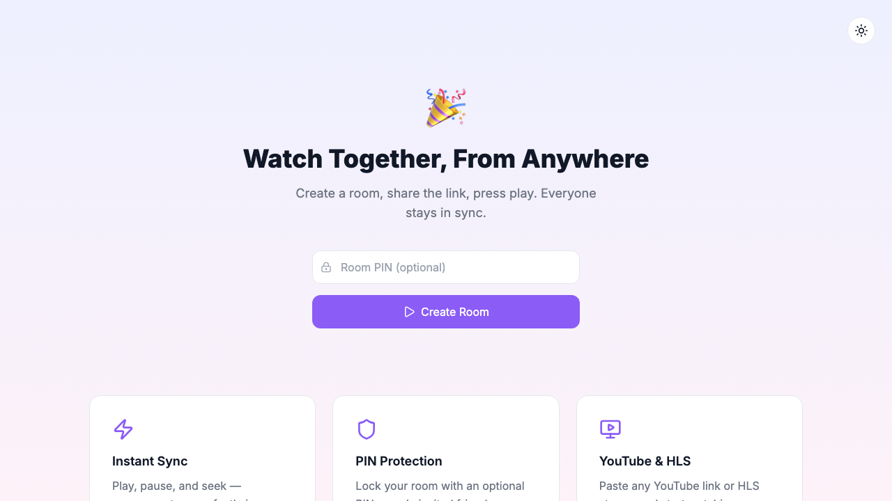
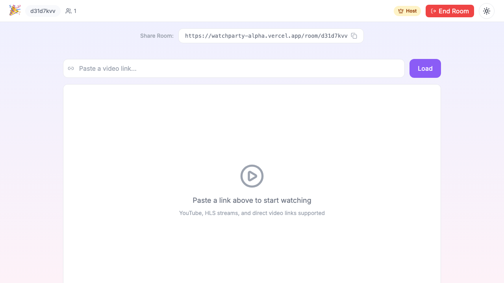

<div align="center">

# 🎉 WatchParty

**Watch Together, From Anywhere**

[](https://github.com/Zer0Wav3s/watchparty/releases)
[](https://nextjs.org)
[](https://partykit.io)
[](https://www.typescriptlang.org)
[](LICENSE)

</div>

---

WatchParty is a serverless synced-video app built with Next.js and PartyKit. Create a room, share the link, paste a video URL, and everyone watches together with synchronized playback controls.





## Features

- **Instant room creation** with shareable room URLs
- **Private rooms** with optional PIN protection
- **YouTube support** via `react-player`
- **Streaming site support** via server-side extraction for `.m3u8` and `.mp4` sources
- **Synchronized play / pause / seek** across viewers
- **Keyboard shortcuts** — Space, arrow keys, J/K/L, M, F
- **Click-to-pause** overlay on non-YouTube videos
- **Livestream mode** with live edge seeking
- **Confetti** on room creation 🎉
- **5 viewers per room** cap
- **Automatic host promotion** when the current host disconnects
- **1-hour idle auto-cleanup** via PartyKit alarms
- **Light/dark theme** toggle, persisted to localStorage
- **Mobile responsive** design
- **Serverless real-time architecture** powered by PartyKit Durable Objects

## Tech Stack

- **Next.js 16.2.2** — app framework and API routes
- **PartyKit** — real-time room state and WebSocket fanout
- **react-player** — YouTube playback
- **HLS.js** — HLS stream playback in the browser
- **cheerio** — HTML parsing for source extraction
- **shadcn/ui** — accessible UI primitives
- **Tailwind CSS** — styling
- **canvas-confetti** — celebration effects

## Prerequisites

Before you start, make sure you have:

- **Node.js 20+**
- **npm**
- A **PartyKit account** (free tier works fine)

## Quick Start

Clone the repository and install dependencies:

```bash
git clone https://github.com/Zer0Wav3s/watchparty.git
cd watchparty
npm install
```

Create a local environment file:

```bash
cp .env.local.example .env.local
```

Set the PartyKit host for local development:

```env
NEXT_PUBLIC_PARTYKIT_HOST=127.0.0.1:1999
```

Start PartyKit in one terminal:

```bash
npx partykit dev
```

Start Next.js in a second terminal:

```bash
npm run dev
```

Open the app:

```text
http://localhost:3000
```

You should now be able to create a room, share the link, and test synced playback locally.

## Deployment

### 1) Deploy PartyKit

Authenticate and deploy your PartyKit worker:

```bash
npx partykit login
npx partykit deploy
```

After deploy, note the PartyKit hostname you receive, for example:

```text
watchparty.your-account.partykit.dev
```

### 2) Deploy the Next.js app

#### Vercel

- Import the GitHub repository into Vercel
- Add the environment variable below:

```env
NEXT_PUBLIC_PARTYKIT_HOST=watchparty.your-account.partykit.dev
```

- Deploy

#### Any Node.js host

You can also deploy the frontend to any Node-compatible host:

```bash
npm run build
npm start
```

Set the same `NEXT_PUBLIC_PARTYKIT_HOST` environment variable in your hosting provider.

## How It Works

Each room maps to a PartyKit Durable Object that stores the shared room state:

- current video URL
- video type (`youtube`, `hls`, or `mp4`)
- playback position
- play / pause state
- connected viewers
- optional room PIN
- current host

Clients connect to the room over WebSockets. When someone plays, pauses, or seeks, the action is broadcast to the other viewers. The host also sends periodic heartbeat updates so clients can correct playback drift if they fall too far behind or jump ahead.

This gives WatchParty real-time sync without running a traditional always-on server.

## Video Extraction

For non-YouTube links, WatchParty tries to extract a playable stream URL on the server.

The extraction flow is:

1. Accept a user-submitted page URL
2. Fetch the HTML server-side
3. Parse it with `cheerio`
4. Look for direct `.m3u8` and `.mp4` sources in:
   - the original URL
   - `<source>` tags
   - `<video>` tags
   - inline scripts
   - regex matches in page HTML
5. Return the best playable source back to the client

If extraction succeeds, the room stores the resolved media URL and all viewers load the same source. If extraction fails, the host gets a clear error instead of a silent failure.

## Environment Variables

| Variable | Required | Example | Description |
| --- | --- | --- | --- |
| `NEXT_PUBLIC_PARTYKIT_HOST` | Yes | `127.0.0.1:1999` (local) / `watchparty.your-account.partykit.dev` (prod) | Hostname used by the frontend to connect to PartyKit |

## Project Structure

```text
watchparty/
├── app/
│   ├── api/
│   │   ├── extract/route.ts      # Extracts .m3u8 / .mp4 URLs from submitted pages
│   │   └── rooms/route.ts        # Creates rooms and initializes PartyKit state
│   ├── room/[id]/page.tsx        # Main watch room page
│   ├── globals.css               # Global styles
│   ├── layout.tsx                # Root layout
│   └── page.tsx                  # Landing page / room creation UI
├── components/
│   ├── HlsPlayer.tsx             # HLS.js video element wrapper
│   ├── PinGate.tsx               # PIN entry UI for protected rooms
│   ├── UrlInput.tsx              # Host-only media submission form
│   ├── VideoPlayer.tsx           # Selects YouTube vs HLS/MP4 playback
│   └── ViewerCount.tsx           # Connected viewer count display
├── lib/
│   ├── extractVideo.ts           # Extraction logic for streaming URLs
│   ├── partykit.ts               # PartyKit connection helpers
│   ├── types.ts                  # Shared room and message types
│   └── utils.ts                  # Helpers and URL utilities
├── party/
│   └── room.ts                   # PartyKit room server logic
├── ARCHITECTURE.md               # Architecture and flow spec
├── README.md                     # Project documentation
├── package.json                  # Scripts and dependencies
└── partykit.json                 # PartyKit configuration
```

## Local Development Notes

- If room creation fails locally, make sure **both** of these are true:
  - `npx partykit dev` is running
  - `NEXT_PUBLIC_PARTYKIT_HOST=127.0.0.1:1999` is set in `.env.local`
- If a streaming link does not resolve, try another source page or a direct `.m3u8` / `.mp4` URL.
- For multi-user sync testing, open the same room in two browser windows.

## Contributing

Contributions are welcome.

1. Fork the repository
2. Create a branch:

```bash
git checkout -b feat/your-change
```

3. Make your changes
4. Run checks:

```bash
npm run build
```

5. Commit and open a pull request against `main`

## License

MIT
